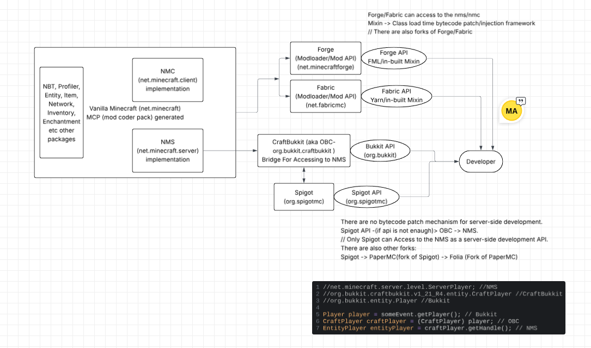

## Architecture

| Platform | Architecture       | Dispatch Strategy |
|----------|--------------------|-------------------|
| **Spigot / Paper** | Event Dispatcher   | Registered listeners are dispatched by `PluginManager`. |
| **Forge** | Event Bus          | Events are posted to one or more `IEventBus` instances. |
| **Fabric** | Event Callback API | Registered callbacks are invoked through `Event<T>` invokers. |

```
Observer Pattern
        │
        ▼
+------------------------+
| Minecraft Event Systems|
+------------------------+
      │       │       │
      ▼       ▼       ▼
 Spigot    Forge   Fabric
Dispatcher EventBus Callback API
```

## Ecosystem


## How it Works
Project itself can work independently of any Minecraft modding platform (framework-agnostic). 
Project intent was not designed to work with any specific Minecraft modding platform.
It is just a demonstration of how to implement a simple event system in Java, inspired by the event systems of popular Minecraft modding platforms.

## Download for Minecraft Modding Platforms
- [Spigot](https://www.spigotmc.org/wiki/buildtools/) - For advanced demonstration of event system (For Craftbukkit & NMS).
- [Spigot-API](https://www.spigotmc.org/wiki/spigot-maven/) - for basic demonstration of event system.
- [Forge](https://files.minecraftforge.net/net/minecraftforge/forge/)
- [Forge-github](https://github.com/MinecraftForge)
- [Fabric](https://fabricmc.net/develop/)

## Minecraft Versions Min JDK Requirements (LTS - Long Term Support)
```
26.1 and later -> java 25
1.20.5 & 1.20.6 (1_20_R4) – 1.21.11 (R7) -> java 21
1.17 – 1.20.4 (1_20_R3) -> Java 17
1.13 – 1.16.5 -> java 11
1.8 - 1.12.2 -> java 8
```