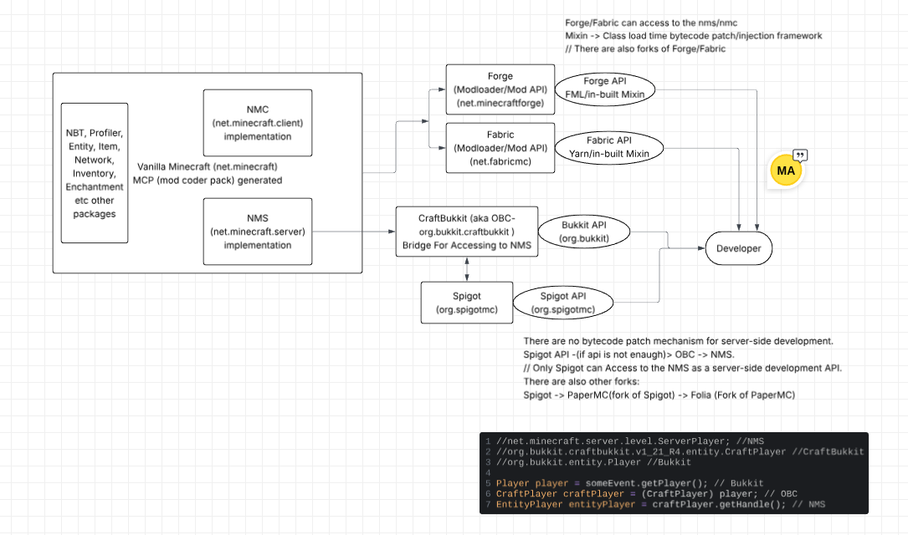

## Architecture

| Platform | Architecture       | Dispatch Strategy |
|----------|--------------------|-------------------|
| **Spigot / Paper** | Event Dispatcher   | Registered listeners are dispatched by `PluginManager`. |
| **Forge** | Event Bus          | Events are posted to one or more `IEventBus` instances. |
| **Fabric** | Event Callback API | Registered callbacks are invoked through `Event<T>` invokers. |

```
Observer Pattern
        │
        ▼
+------------------------+
| Minecraft Event Systems|
+------------------------+
      │       │       │
      ▼       ▼       ▼
 Spigot    Forge   Fabric
Dispatcher EventBus Callback API
```

## Ecosystem
For original diagram: [LucidChart Link](https://lucid.app/lucidchart/c92eac3b-899d-42aa-8241-5f5cc76dee75/edit?viewport_loc=8%2C-98%2C2958%2C1582%2C0_0&invitationId=inv_66e00f46-accd-48ba-8d1f-95ca54ad94a0)



## How it Works
Project itself can work independently of any Minecraft modding platform (framework-agnostic). 
Project intent was not designed to work with any specific Minecraft modding platform.
It is just a demonstration of how to implement a simple event system in Java, inspired by the event systems of popular Minecraft modding platforms.

## Download for Minecraft Modding Platforms
- [Spigot Buildtool](https://www.spigotmc.org/wiki/buildtools/)
- [Spigot Maven](https://www.spigotmc.org/wiki/spigot-maven/)
- [Forge](https://files.minecraftforge.net/net/minecraftforge/forge/)
- [Forge-github](https://github.com/MinecraftForge)
- [Fabric](https://fabricmc.net/develop/)

## Minecraft Versions Min JDK Requirements (LTS - Long Term Support)
```
26.1 and later -> java 25
1.20.5 & 1.20.6 (1_20_R4) – 1.21.11 (R7) -> java 21
1.17 – 1.20.4 (1_20_R3) -> Java 17
1.13 – 1.16.5 -> java 11
1.8 - 1.12.2 -> java 8
```
## What is Mappings ?
The mappings are used to translate the obfuscated names of classes, methods, and fields in the Minecraft codebase into more readable names that developers can work with.
This allows developers to write plugins and mods for Minecraft without having to deal with the complexities of the obfuscated code.

On 29th October 2025, Mojang has announced that they will stop obfuscating Minecraft: Java Edition builds. This means that the game's code will now be shipped with readable names by default, largely eliminating the need for remapping tools and community-driven mapping projects like Yarn.
Given that there are no longer obfuscated names to translate from, the purpose of this site has effectively come to an end. It will stay online for archival purposes, but no further updates or maintenance will be performed.
[Mappings](https://mappings.dev/main.html)

## Minecraft Mappings
```
1.14.4 - Latest -> Mojang's official & Searge & Spigot & Intermediary & Yarn mappings
1.13.2 - 1.14.3 -> Searge & Spigot & Intermediary & Yarn mappings
1.8.8 - 1.13.2 -> Searge & Spigot mappings

// Yarn -> Fabric
// Searge -> Forge
```

## Spigot Jars
BuildTools ile `spigot-26.2` build edildikten sonra local `.m2` repository'sine kurulan jar'lar
(JADX projesine eklenenler):

```
~/.m2/repository/org/spigotmc/
spigot-api/26.2-R0.1-SNAPSHOT/spigot-api-26.2-R0.1-SNAPSHOT.jar
spigot/26.2-R0.1-SNAPSHOT/spigot-26.2-R0.1-SNAPSHOT.jar
```

- `spigot-api-...jar`: Bukkit API (`org.bukkit.*`). Event sistemi (`HandlerList`, `SimplePluginManager`,
  `JavaPluginLoader`...) tamamen burada; `spigot-event-dispatcher` bu jar'dan uretildi.
- `spigot-...jar`: Mojang-mapped NMS (`net.minecraft.*`) + OBC (`org.bukkit.craftbukkit.*`). API'yi
  implemente eden ve event'leri fiilen tetikleyen sunucu tarafi (`CraftServer`,
  `ServerGamePacketListenerImpl`...). 3rd-party bagimlilik icermez.

`~/<optional-folder>/Buildtools/spigot-26.2.jar` (bundler) sunucuyu calistirmak icindir: kendi
icinde sadece bootstrap `Main` var, yukaridaki iki jar'i (ve Guava/Netty gibi bagimliliklari)
`META-INF/libraries/` ve `META-INF/versions/` altinda ic ice jar olarak tasir. JADX ic ice jar'lari
da acar, ama ayni siniflari iki kez yukler ("Classes with same name are omitted"); bu yuzden
yukaridaki iki jar yeterli.

## Forge Jars
`forge-26.1.2-64.0.8-mdk` kurulumunda ForgeGradle'in indirdigi jar'lar
(MDK'daki `annotationProcessor 'net.minecraftforge:eventbus-validator:7.0.1'` surumu dogruluyor):

```
~/.gradle/caches/minecraftforge/forgegradle/mavenizer/caches/maven/forge/net/minecraftforge/
eventbus/7.0.1/eventbus-7.0.1.jar
javafmllanguage/26.1.2-64.0.8/javafmllanguage-26.1.2-64.0.8.jar
fmlcore/26.1.2-64.0.8/fmlcore-26.1.2-64.0.8.jar
fmlloader/26.1.2-64.0.8/fmlloader-26.1.2-64.0.8.jar
forge/26.1.2-64.0.8/forge-26.1.2-64.0.8-universal.jar
```
## Fabric Jars
`~/MinecraftWorkspace/fabric/template-mod-26.1.2` sablonunun build'inde Gradle'in indirdigi jar'lar
(`~/.gradle/caches/modules-2/files-2.1/` altinda):

```
net.fabricmc/fabric-loader/0.19.5/fabric-loader-0.19.5.jar
net.fabricmc.fabric-api/fabric-api-base/2.0.3+ece063234c/fabric-api-base-2.0.3+ece063234c.jar
net.fabricmc.fabric-api/fabric-lifecycle-events-v1/4.1.1+df84eb3d4c/fabric-lifecycle-events-v1-4.1.1+df84eb3d4c.jar
net.fabricmc.fabric-api/fabric-message-api-v1/7.0.5+dae8ce3e4c/fabric-message-api-v1-7.0.5+dae8ce3e4c.jar
```
