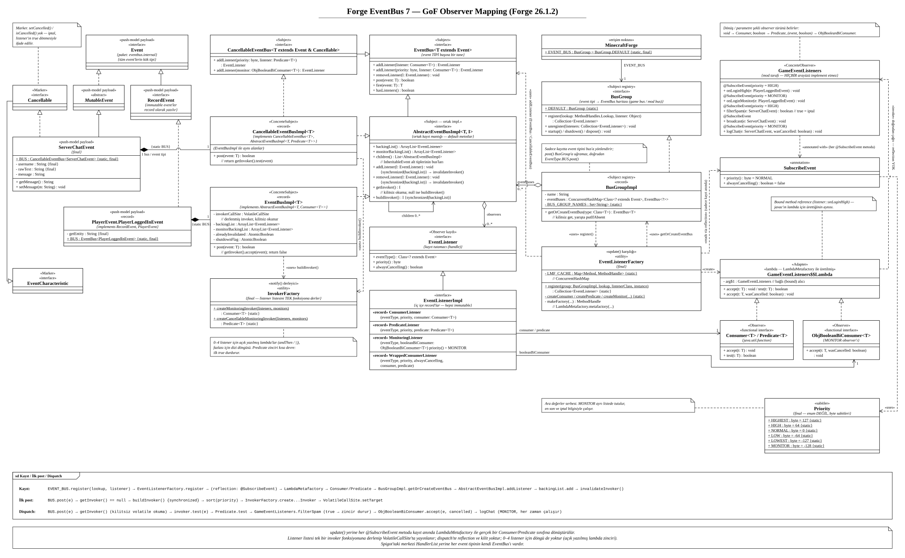

# forge-event-bus

Forge 26.1.2-64.0.8 event bus'inin (EventBus 7.0.1) ve mod yukleme (FML) mekanizmasinin JADX ile
incelenip yeniden uretilmis hali. Concurrency analizi: [concurrency-model.md](concurrency-model.md).

## GoF Observer eslesmesi



## Modul ayrimi

| Gercek ekosistem | Bizim modulumuz | Rolu |
|---|---|---|
| `eventbus`, `fmlcore`, `javafmllanguage`, `forge-universal` | **forge-event-bus** | Event bus, mod yukleme lifecycle'i, game bus ve oyun event'leri |
| Bir mod jar'i (`mods.toml` + `@Mod` sinifi) | **forge-mod-impl** | Ornek mod'lar ve "sunucu"yu temsil eden `Main` |

## Sinif haritasi

| Gercek Forge sinifi | Bizim sinifimiz | Durum |
|---|---|---|
| `eventbus.api.bus.BusGroup` / `EventBus` / `CancellableEventBus` | `eventbus.api.bus.*` | birebir |
| `eventbus.api.event.MutableEvent` / `RecordEvent` / `InheritableEvent` | `eventbus.api.event.*` | birebir; `MutableEvent` `MutableEventInternals`'i extend etmiyor |
| `eventbus.api.event.characteristic.Cancellable` | `eventbus.api.event.characteristic.Cancellable` | birebir; `MonitorAware`, `SelfDestructing`, `SelfPosting` yok |
| `eventbus.api.listener.EventListener` / `ObjBooleanBiConsumer` / `Priority` / `SubscribeEvent` | `eventbus.api.listener.*` | birebir |
| `eventbus.internal.Event` / `EventCharacteristic` | `eventbus.internal.*` | birebir |
| `eventbus.internal.AbstractEventBusImpl` / `EventBusImpl` / `CancellableEventBusImpl` | `eventbus.internal.*` | birebir (MonitorAware / SelfDestructing dallari yok) |
| `eventbus.internal.BusGroupImpl` | `eventbus.internal.BusGroupImpl` | birebir, `getOrCreateEventBus` yarisi dahil |
| `eventbus.internal.EventListenerImpl` / `InvokerFactoryUtils` | `eventbus.internal.*` | birebir |
| `eventbus.internal.InvokerFactory` | `eventbus.internal.InvokerFactory` | **kismi**: always-cancelling ve MonitorAware ozel durumlari yok |
| `eventbus.internal.EventListenerFactory` | `eventbus.internal.EventListenerFactory` | **kismi**: sadece lenient kayit, `registerStrict` yok |
| `fml.ModLoadingStage` | `fml.ModLoadingStage` | **kismi**: sadece CONSTRUCT, COMMON_SETUP, COMPLETE |
| `fml.DeferredWorkQueue` / `ModWorkManager` / `ThreadSelector` | `fml.*` | birebir (worker isimlendirmesi duzeltildi, bkz. concurrency-model.md) |
| `fml.ModContainer` / `ModLoadingContext` / `ModList` | `fml.*` | **kismi**: extension point, config, display test, mod dosyalari ve "minecraft" container'i yok |
| `fml.ModLoader` / `ModStateTransitionHelper` / `IModStateTransition` / `ModLoadingState` | `fml.*` | **kismi**: progress bar, hata toplama (`gather`), pre/post sync task yok |
| `fml.core.ParallelTransition` / `ModStateProvider` | `fml.core.*` | birebir mekanizma, 3 asama |
| `fml.event.IModBusEvent`, `fml.event.lifecycle.*` | `fml.event.*` | **kismi**: IMC ve sided setup event'leri yok |
| `fml.javafmlmod.FMLModContainer` / `FMLJavaModLoadingContext` | `fml.javafmlmod.*` | **kismi**: module layer / classloading yok |
| `fml.javafmlmod.AutomaticEventSubscriber` | `fml.javafmlmod.AutomaticEventSubscriber` | **kismi**: ASM taramasi ve `IMPL_LOOKUP` yerine `ModInfo` listesi ve `privateLookupIn` |
| `fml.common.Mod` (+ `EventBusSubscriber`) | `fml.common.Mod` | **kismi**: `Dist` (client/server) secimi yok |
| `common.MinecraftForge.EVENT_BUS` | `common.MinecraftForge.EVENT_BUS` | **kismi**: `EventBusMigrationHelper` yerine dogrudan `BusGroup.DEFAULT` |
| `IModInfo` + `ModFileScanData` | `fml.ModInfo` | sadelestirilmis yerine gecen (mods.toml ve jar taramasi yok) |
| `event.ServerChatEvent` | `event.ServerChatEvent` | **kismi**: `ServerPlayer`/`Component` yerine `String` |
| `event.entity.player.PlayerEvent` | `event.entity.player.PlayerEvent` | **kismi**: `Player` yerine `String`, sadece `PlayerLoggedInEvent`/`PlayerLoggedOutEvent` |
| `event.TickEvent` | `event.TickEvent` | **kismi**: sadece `ServerTickEvent.Pre/Post`, `MinecraftServer` alani yok |

## CLI demo

Demo `forge-mod-impl` modulunde; bu modul `forge-event-bus`'a, gercek bir mod'un Forge'a bagimli
olmasi gibi bagimli. Proje kok dizininden:

```
./gradlew :forge-event-bus:compileJava :forge-mod-impl:compileJava
java -cp forge-event-bus/build/classes/java/main:forge-mod-impl/build/classes/java/main \
     me.erano.com.forge.example.Main
```

`Main` uc mod yukler (`examplemod`, ona bagimli `dependentmod` ve bagimsiz `independentmod`) ve su
adimlari calistirir:

1. Mod yukleme: CONSTRUCT, COMMON_SETUP ve COMPLETE asamalari `modloading-worker` thread'lerinde
   paralel calisir. `dependentmod`, `examplemod` bitmeden baslamaz; `enqueueWork` ile birakilan is
   asama sonunda `main` thread'de calisir.
2. Game bus'ta oncelik sirasi (`HIGH` -> `NORMAL` -> `MONITOR`).
3. Iptal: `true` donen listener zinciri keser, `MONITOR` listener'i iptal bilgisiyle yine calisir.
4. Concurrency stres testi: concurrent `addListener`/`removeListener` altinda kilitsiz `post`.

## Kaynak jar'lar (JADX ile incelenenler)

`forge-26.1.2-64.0.8-mdk` kurulumunda ForgeGradle'in indirdigi jar'lar
(MDK'daki `annotationProcessor 'net.minecraftforge:eventbus-validator:7.0.1'` surumu dogruluyor):

```
~/.gradle/caches/minecraftforge/forgegradle/mavenizer/caches/maven/forge/net/minecraftforge/
eventbus/7.0.1/eventbus-7.0.1.jar
javafmllanguage/26.1.2-64.0.8/javafmllanguage-26.1.2-64.0.8.jar
fmlcore/26.1.2-64.0.8/fmlcore-26.1.2-64.0.8.jar
fmlloader/26.1.2-64.0.8/fmlloader-26.1.2-64.0.8.jar
forge/26.1.2-64.0.8/forge-26.1.2-64.0.8-universal.jar
```

| Forge jar'i | Icerigi | Spigot'taki karsiligi |
|---|---|---|
| `eventbus-7.0.1` | `BusGroup`, `EventBus`, listener kaydi (`LambdaMetafactory`), dispatch (`InvokerFactory`) | `HandlerList`, `SimplePluginManager.callEvent` |
| `javafmllanguage-26.1.2-64.0.8` | `@Mod`, `FMLModContainer`, `@EventBusSubscriber` ile otomatik kayit | `JavaPlugin`, `JavaPluginLoader` |
| `fmlcore-26.1.2-64.0.8` | `ModLoader`, `ModContainer`, `ModWorkManager` (paralel executor), `DeferredWorkQueue` | `PluginManager` lifecycle'i, `enablePlugin` |
| `fmlloader-26.1.2-64.0.8` | Mod kesfi ve annotation taramasi (bu modulde kullanilmadi) | Plugin jar kesfi, `plugin.yml` okuma |
| `forge-26.1.2-64.0.8-universal` | `MinecraftForge.EVENT_BUS`, `ParallelTransition`, `ModStateProvider`, lifecycle ve oyun event'leri | Bukkit'in oyun event'leri |
