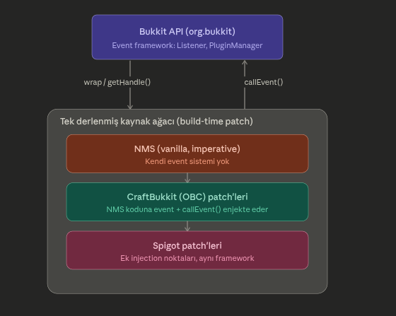

# spigot-event-dispatcher

Gercek Spigot/Bukkit (26.2, `spigot-26.2.jar`) event dispatch mekanizmasinin, JADX ile tersine
muhendislik yapilarak, birebir (satir satir taninabilir) sekilde yeniden uretilmis hali.
Amac production bir sunucu implementasyonu degil; GoF **Observer** pattern'inin ve
concurrency (JCiP) konularinin gercek, production-grade bir kod tabaninda nasil kullanildigini
calismak.



## Sinif haritasi

| Gercek Bukkit sinifi | Bizim sinifimiz | Durum |
|---|---|---|
| `org.bukkit.event.Event` | `event.Event` | birebir |
| `org.bukkit.event.Listener` | `event.Listener` | birebir (marker interface) |
| `org.bukkit.event.EventPriority` | `event.EventPriority` | birebir |
| `org.bukkit.event.EventHandler` | `event.EventHandler` | birebir |
| `org.bukkit.event.Cancellable` | `event.Cancellable` | birebir |
| `org.bukkit.event.HandlerList` | `event.HandlerList` | birebir |
| `org.bukkit.plugin.RegisteredListener` | `plugin.RegisteredListener` | birebir (`Plugin` -> `Application`) |
| `org.bukkit.plugin.TimedRegisteredListener` | `plugin.TimedRegisteredListener` | birebir |
| `org.bukkit.plugin.EventExecutor` | `plugin.EventExecutor` | birebir |
| `org.bukkit.plugin.EventException` | `event.EventException` | birebir |
| `org.bukkit.plugin.PluginManager` | `plugin.PluginManager` | **kismi** — sadece event ile ilgili 4 metot (bkz. asagida) |
| `org.bukkit.plugin.SimplePluginManager` | `plugin.SimplePluginManager` | **kismi** — event dispatch hatti birebir, permission/plugin-loading yok |
| `org.bukkit.plugin.java.JavaPluginLoader#createRegisteredListeners` | `plugin.JavaPluginLoader` | **kismi** — sadece bu metot birebir; jar/classloading yok |
| `org.bukkit.plugin.Plugin` | `plugin.Application` | **sadelestirilmis** — sadece `getName()`/`isEnabled()` |
| `org.bukkit.plugin.IllegalPluginAccessException` | `plugin.IllegalPluginAccessException` | birebir |

Her "kismi" satirin gerekcesi ilgili sinifin basindaki yorum blogunda aciklaniyor: hangi
mekanizmanin implement edilmedigi ve gercekte neyi hallettigi. Ozet olarak disarida
birakilanlar: plugin jar/dosya yukleme + bagimlilik cozumleme (`PluginLoader`,
dependency graph), permission/permissible yetkilendirme alt sistemi, komut kaydi
(`SimpleCommandMap`) ve plugin yasam donguesu (`enablePlugin`/`disablePlugin`). Bunlarin
hicbiri event dispatch veya concurrency mekanizmasinin parcasi degil.

## Event kayit + dispatch akisi

```
Application.main()
  └─ pluginManager.registerEvents(listener, app)
       └─ JavaPluginLoader.createRegisteredListeners(listener, app)   // reflection: @EventHandler tara
            └─ her handler icin bir EventExecutor (adapter) uret
       └─ HandlerList.registerAll(...)                                 // EventPriority slotuna ekle

pluginManager.callEvent(event)
  └─ thread dogrulamasi (isAsynchronous() / isPrimaryThread())         // bkz. Concurrency
  └─ fireEvent(event)
       └─ handlers = event.getHandlers()            // her Event alt sinifinin STATIK HandlerList'i
       └─ handlers.getRegisteredListeners()          // volatile 'handlers' dizisini oku, gerekirse bake()
       └─ for (listener : listeners) listener.callEvent(event)   // sirali, AYNI thread'de, senkron
```

`getHandlers()` (instance, abstract) ile `getHandlerList()` (static, konvansiyon) arasindaki
fark onemli: static metotlar Java'da polimorfik degildir, bu yuzden `PluginManager` kayit
sirasinda hangi `HandlerList`'e yazacagini **reflection** ile bulur
(`SimplePluginManager.getEventListeners` / `getRegistrationClass`). Bu, compiler'in
zorlayamadigi ama Bukkit'in her Event alt sinifindan beklendigi bir sozlesmedir — unutulursa
calisma zamaninda `IllegalPluginAccessException` firlar.

## Concurrency mekanizmalari (JCiP baglantilari)

1. **Safe publication (`HandlerList.handlers`, `volatile RegisteredListener[]`)**
   Baked (derlenmis) listener dizisi immutable olarak yayinlanir. `getRegisteredListeners()`
   lock almadan bu alani okur; `null` ise `synchronized bake()`'e duser ve tekrar dener
   (spin/retry). Sonuc: cogu okuma tamamen lock-free, sadece cache gecersizken kilide giriliyor.

2. **Iki seviyeli kilitleme (lock ordering)**
   `HandlerList.unregisterAll(Application)` gibi statik metotlar once `synchronized(allLists)`
   sonra her `HandlerList` icin `synchronized(h)` aliyor. Sira her zaman ayni (once global liste,
   sonra instance), bu yuzden deadlock riski yok.

3. **Coarse-grained locking (`register`/`unregister`)**
   Instance metotlari `synchronized` (intrinsic lock, `this` uzerinden) — HandlerList basina
   tek bir mutex, ince taneli kilitleme yok (basitlik/dogruluk > throughput tercihi).

4. **Thread validasyonu, thread YONETIMI degil (`SimplePluginManager.callEvent`)**
   Bu proje uzerinde jadx ile dogruladigim en onemli bulgu: event sisteminde **hicbir
   `ExecutorService`/thread pool/Netty baglantisi yok**. `callEvent` sadece cagiran thread'in
   dogru olup olmadigini kontrol ediyor (`isPrimaryThread()`, `Thread.holdsLock(this)`);
   dispatch tamamen `fireEvent` icindeki duz `for` donguisuyle, **cagiran thread'in kendisinde**
   gerceklesiyor. "Async event" = "ayri thread'de calistirilacak" degil, "ayri thread'den
   cagirilmasi zorunlu/beklenen" demek — sorumluluk cagirana ait, HandlerList/PluginManager
   kendisi hicbir thread yaratmiyor. (Gercek sunucuda async event'leri kim ayri thread'den
   tetikliyor? Netty'nin paket isleme thread'leri — ama bu, event sisteminin DISINDA, ayri bir
   katman.)

5. **`Application.concurrencyDemo()`** — yukaridaki 1-3'u gercek contention altinda calistirir:
   birden fazla "publisher" thread'i surekli `AsyncPingEvent` tetiklerken, birden fazla "churn"
   thread'i ayni `HandlerList`'e concurrent `register`/`unregister` yapar. Sonuc: hicbir
   `ArrayIndexOutOfBoundsException`/kayip event olmadan tum event'ler dogru sekilde teslim
   edilir — safe publication'in calistiginin canli kaniti.

## CLI demo nasil calisir

```
./gradlew :spigot-event-dispatcher:compileJava
java -cp spigot-event-dispatcher/build/classes/java/main:<annotations-jar> me.erano.com.bukkit.plugin.Application
```

`Application.main()` sirasiyla gosterir:
1. Senkron event, ana thread'de, `EventPriority` sirasina gore (`LOWEST` -> `NORMAL` -> `MONITOR`).
2. Async bir event'i **yanlislikla** ana thread'den tetikleme denemesi -> `IllegalStateException`.
3. Ayni event'in **dogru** sekilde ayri bir thread'den tetiklenmesi + `Cancellable`/`ignoreCancelled` etkilesimi (`ExampleListener`).
4. Yukaridaki concurrency stres testi (`concurrencyDemo`).

## GoF Observer eslesmesi

- **Subject** -> `Event` (+ kendi statik `HandlerList`'i)
- **Observer** -> `Listener` (marker interface; gercek "update" mekanizmasi `@EventHandler`
  annotasyonu + reflection ile kuruluyor, GoF'taki klasik `update()` metodunun yerini aliyor)
- **ConcreteSubject** -> `PlayerJoinEvent`, `AsyncPlayerChatEvent`, `AsyncPingEvent`
- **ConcreteObserver** -> `ExampleListener`, `PingCounterListener`
- **Dispatcher/Mediator** -> `SimplePluginManager` (Subject'i Observer'lara baglayan katman)

## Kaynak (JADX ile dogrulanan siniflar)

`spigot-26.2.jar:META-INF/libraries/spigot-api-26.2-R0.1-SNAPSHOT.jar` icinden:
`org.bukkit.event.HandlerList`, `org.bukkit.plugin.PluginManager`,
`org.bukkit.plugin.SimplePluginManager`, `org.bukkit.plugin.java.JavaPluginLoader`,
`org.bukkit.plugin.IllegalPluginAccessException`.
