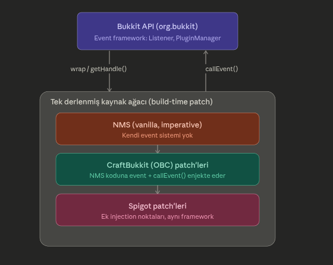
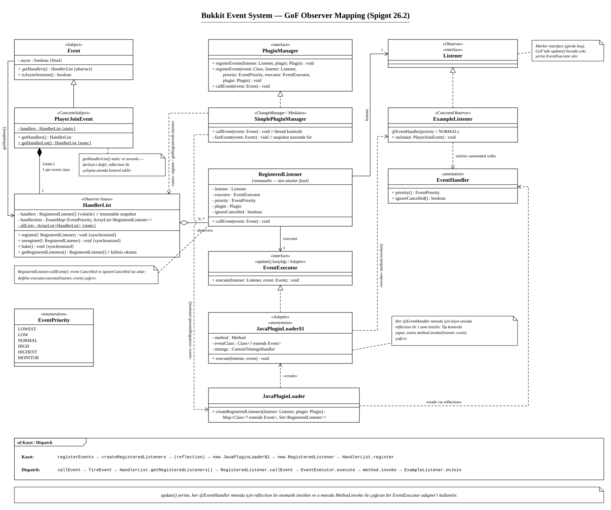

# spigot-event-dispatcher

Spigot/Bukkit 26.2 event dispatch mekanizmasinin JADX ile incelenip yeniden uretilmis hali.
Concurrency analizi: [concurrency-model.md](concurrency-model.md).



## GoF Observer eslesmesi



## Sinif haritasi

| Gercek Bukkit sinifi | Bizim sinifimiz | Durum |
|---|---|---|
| `org.bukkit.event.Event` | `event.Event` | birebir |
| `org.bukkit.event.Listener` | `event.Listener` | birebir (marker interface) |
| `org.bukkit.event.EventPriority` | `event.EventPriority` | birebir |
| `org.bukkit.event.EventHandler` | `event.EventHandler` | birebir |
| `org.bukkit.event.Cancellable` | `event.Cancellable` | birebir |
| `org.bukkit.event.HandlerList` | `event.HandlerList` | birebir |
| `org.bukkit.plugin.RegisteredListener` | `plugin.RegisteredListener` | birebir (`getPlugin()` dahil) |
| `org.bukkit.plugin.TimedRegisteredListener` | `plugin.TimedRegisteredListener` | birebir |
| `org.bukkit.plugin.EventExecutor` | `plugin.EventExecutor` | birebir |
| `org.bukkit.plugin.EventException` | `event.EventException` | birebir |
| `org.bukkit.plugin.PluginManager` | `plugin.PluginManager` | **kismi** — sadece event ile ilgili 4 metot |
| `org.bukkit.plugin.SimplePluginManager` | `plugin.SimplePluginManager` | **kismi** — event dispatch hatti birebir, permission/plugin-loading yok |
| `org.bukkit.plugin.Plugin` | `plugin.Plugin` | **kismi** — sadece lifecycle + kimlik (7 metot); `getServer`/`getConfig`/dunya uretimi/komut sistemi yok (bkz. `Plugin.java` basindaki yorum) |
| `org.bukkit.plugin.PluginBase` | `plugin.PluginBase` | birebir (`equals`/`hashCode` isim-bazli) |
| `org.bukkit.plugin.java.JavaPlugin` | `plugin.java.JavaPlugin` | **kismi** — `isEnabled`/`onEnable`/`onDisable`/`onLoad`/`setEnabled` (otomatik onEnable/onDisable tetikleme) ve `isNaggable`/`setNaggable` birebir; `PluginClassLoader`/`Server`/`FileConfiguration`/`PluginDescriptionFile` yok |
| `org.bukkit.plugin.java.JavaPluginLoader` | `plugin.java.JavaPluginLoader` | **kismi** — `createRegisteredListeners` + `enablePlugin`/`disablePlugin` (paket-ici `setEnabled` cagrisi) birebir; jar/classloading/`PluginEnableEvent` yok |
| `org.bukkit.plugin.IllegalPluginAccessException` | `plugin.IllegalPluginAccessException` | birebir |

## CLI demo

Demo `spigot-plugin-impl` modulunde; bu modul `spigot-event-dispatcher`'a, gercek bir plugin'in
spigot-api'ye bagimli olmasi gibi bagimli. Proje kok dizininden:

```
./gradlew :spigot-event-dispatcher:compileJava :spigot-plugin-impl:compileJava
java -cp spigot-event-dispatcher/build/classes/java/main:spigot-plugin-impl/build/classes/java/main \
     me.erano.com.bukkit.example.Main
```

`Main` sunucuyu temsil eder: `ExamplePlugin`'i enable eder ve su adimlari calistirir:

1. Sync event, main thread'de, `EventPriority` sirasiyla (`LOWEST` -> `NORMAL` -> `MONITOR`).
2. Async event'i main thread'den tetikleme denemesi -> `IllegalStateException`.
3. Async event'i ayri bir thread'den tetikleme + `Cancellable`/`ignoreCancelled`.
4. Concurrency stres testi: concurrent `register`/`unregister` altinda async dispatch.
5. Plugin'i devre disi birakma.
